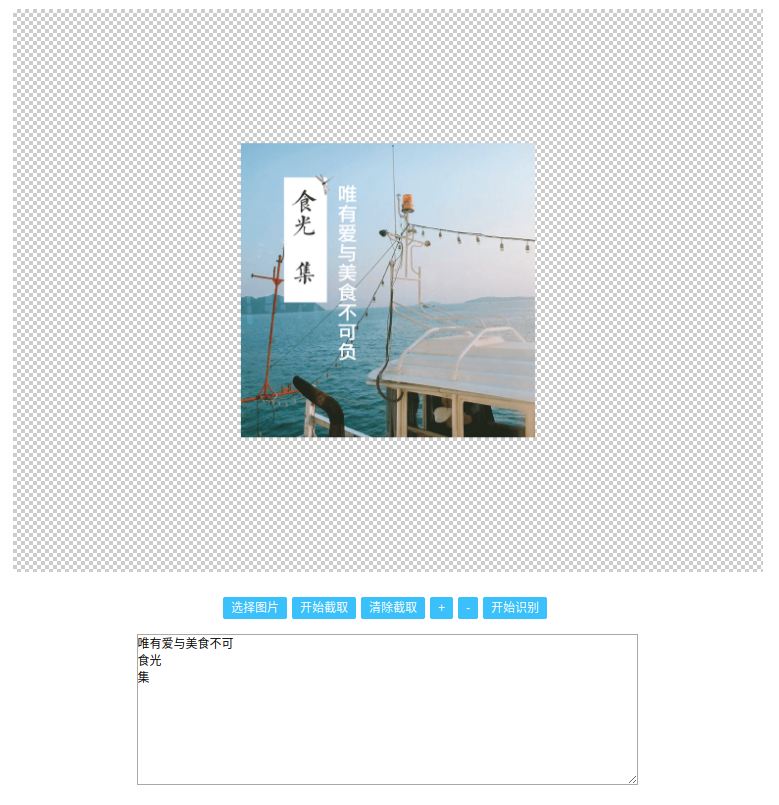

# 2019.9.27 UPDATE
* add flask app 添加flask应用
* add baidu-ocr API 添加百度文字识别API
* add front-end image upload&intercept interface 添加前端图片上传与截取交互界面

Run：python route.py and then open http://127.0.0.1:5000

Description：
* the picture clipping plugin is from https://github.com/xyxiao001/vue-cropper,thanks to xyxiao001
* add your own key in baidu_api/config.json,also you can change the address of API in baidu_api/textGO.py
* 
# AdvancedEAST
AdvancedEAST is an algorithm used for Scene image text detect,
which is primarily based on
[EAST:An Efficient and Accurate Scene Text Detector](https://arxiv.org/abs/1704.03155v2),
and the significant improvement was also made,
which make long text predictions more accurate.
If this project is helpful to you, welcome to star.
And if you have any problem, please contact me.
* email:yijie.huo@foxmail.com

# advantages
* writen in keras, easy to read and run
* base on EAST, an advanced text detect algorithm
* easy to train the model
* significant improvement was made, long text predictions more accurate.(please
see 'demo results' part bellow,
and pay attention to the activation image,
which starts with yellow grids, and ends with green grids.) 

In my experiments,
AdvancedEast has obtained much better prediction accuracy then East,
especially on long text. Since East calculates final vertexes coordinates with
weighted mean values of predicted vertexes coordinates of all pixels. It is too
difficult to predict the 2 vertexes from the other side of the quadrangle.
See East limitations picked from original paper bellow.

# project files
* config file:cfg.py,control parameters
* pre-process data:
    preprocess.py,resize image
* label data:
    label.py,produce label info
* define network
    network.py
* define loss function
    losses.py
* execute training
    advanced_east.py and data_generator.py
* predict
    predict.py and nms.py
    
**后置处理过程说明参见
[后置处理(含原理图)](https://huoyijie.github.io/zh-Hans/2018/08/27/AdvancedEAST%E5%90%8E%E7%BD%AE%E5%A4%84%E7%90%86%E5%8E%9F%E7%90%86%E7%AE%80%E4%BB%8B/)**

# network arch
* AdvancedEast

**网络输出说明：
输出层分别是1位score map, 是否在文本框内；2位vertex code，是否属于文本框边界像素以及是头还是尾；4位geo，是边界像素可以预测的2个顶点坐标。所有像素构成了文本框形状，然后只用边界像素去预测回归顶点坐标。边界像素定义为黄色和绿色框内部所有像素，是用所有的边界像素预测值的加权平均来预测头或尾的短边两端的两个顶点。头和尾部分边界像素分别预测2个顶点，最后得到4个顶点坐标。**

[原理简介(含原理图)](https://huoyijie.github.io/zh-Hans/2018/08/24/AdvancedEAST%E6%96%87%E6%9C%AC%E6%A3%80%E6%B5%8B%E5%8E%9F%E7%90%86%E7%AE%80%E4%BB%8B/)

* East

# setup
* python 3.6.3+
* tensorflow-gpu 1.5.0+(or tensorflow 1.5.0+)
* keras 2.1.4+
* numpy 1.14.1+
* tqdm 4.19.7+

# training
* tianchi ICPR dataset download
链接: https://pan.baidu.com/s/1NSyc-cHKV3IwDo6qojIrKA 密码: ye9y

* prepare training data:make data root dir(icpr),
copy images to root dir, and copy txts to root dir,
data format details could refer to 'ICPR MTWI 2018 挑战赛二：网络图像的文本检测',
[Link](https://tianchi.aliyun.com/competition/introduction.htm?spm=5176.100066.0.0.3bcad780oQ9Ce4&raceId=231651)
* modify config params in cfg.py, see default values.
* python preprocess.py, resize image to 256*256,384*384,512*512,640*640,736*736,
and train respectively could speed up training process.
* python label.py
* python advanced_east.py, train entrance
* python predict.py -p demo/001.png, to predict
* pretrain model download(use for test)
链接: https://pan.baidu.com/s/1KO7tR_MW767ggmbTjIJpuQ 密码: kpm2

# demo results

* compared with east based on vgg16

As you can see, although the text area prediction is very accurate, the vertex coordinates are not accurate enough.

# License
The codes are released under the MIT License.

# references
* [EAST:An Efficient and Accurate Scene Text Detector](https://arxiv.org/abs/1704.03155v2)

* [CTPN:Detecting Text in Natural Image with Connectionist Text Proposal Network](https://arxiv.org/abs/1609.03605)

* [Deep Matching Prior Network: Toward Tighter Multi-oriented Text Detection](https://arxiv.org/abs/1703.01425)

**网络输出说明：
输出层分别是1位score map, 是否在文本框内；2位vertex code，是否属于文本框边界像素以及是头还是尾；4位geo，是边界像素可以预测的2个顶点坐标。所有像素构成了文本框形状，然后只用边界像素去预测回归顶点坐标。边界像素定义为黄色和绿色框内部所有像素，是用所有的边界像素预测值的加权平均来预测头或尾的短边两端的两个顶点。头和尾部分边界像素分别预测2个顶点，最后得到4个顶点坐标。**

[原理简介(含原理图)](https://huoyijie.github.io/zh-Hans/2018/08/24/AdvancedEAST%E6%96%87%E6%9C%AC%E6%A3%80%E6%B5%8B%E5%8E%9F%E7%90%86%E7%AE%80%E4%BB%8B/)

**后置处理过程说明参见
[后置处理(含原理图)](https://huoyijie.github.io/zh-Hans/2018/08/27/AdvancedEAST%E5%90%8E%E7%BD%AE%E5%A4%84%E7%90%86%E5%8E%9F%E7%90%86%E7%AE%80%E4%BB%8B/)**
